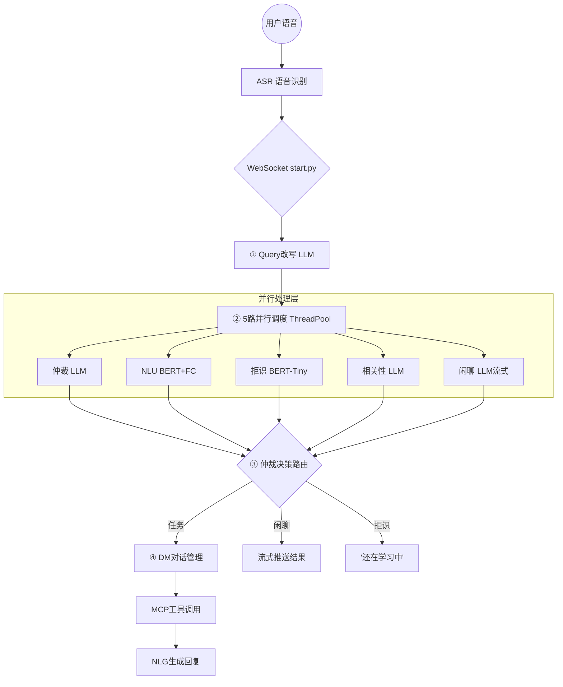

# 🎙️ LLM + Agent + MCP 全域智能语音对话系统

> 一个工业级车载智能语音助手系统，融合 **小模型（BERT意图分类）+ 大模型（LLM Function Calling）+ MCP协议（工具调用）**，支持任务型指令、百科闲聊、多轮对话、流式语音回复。

---

## 📑 目录

- [项目概述](#项目概述)
- [系统架构](#系统架构)
- [核心技术知识点](#核心技术知识点)
  - [1. 整体服务框架](#1-整体服务框架)
  - [2. Query 改写（指代消解）](#2-query-改写指代消解)
  - [3. 仲裁模块（领域分流）](#3-仲裁模块领域分流)
  - [4. NLU 两阶段意图识别](#4-nlu-两阶段意图识别)
  - [5. 拒识模块](#5-拒识模块)
  - [6. 相关性判断](#6-相关性判断)
  - [7. 闲聊模块（流式对话）](#7-闲聊模块流式对话)
  - [8. DM 对话管理](#8-dm-对话管理)
  - [9. MCP 协议与工具调用](#9-mcp-协议与工具调用)
  - [10. NLG 自然语言生成](#10-nlg-自然语言生成)
  - [11. BERT 模型训练](#11-bert-模型训练)
  - [12. 会话管理（Redis）](#12-会话管理redis)
  - [13. 流式三帧协议](#13-流式三帧协议)
- [项目目录结构](#项目目录结构)
- [完整请求流程示例](#完整请求流程示例)
- [评估体系](#评估体系)
- [技术栈总览](#技术栈总览)
- [学习笔记与心得](#学习笔记与心得)

---

## 项目概述

### 背景

车载语音助手需要在极低延迟（<2s）下，准确理解用户的语音指令并执行操作。用户可能说：

| 场景 | 用户说的话 | 系统要做的事 |
|------|-----------|-------------|
| 车辆控制 | "把空调调到26度" | 识别意图=设置空调温度，槽位=26度，下发车控指令 |
| 导航 | "导航去最近的加油站" | 识别意图=导航搜索，调高德API搜POI，开始导航 |
| 音乐 | "来首周杰伦的歌" | 识别意图=音乐搜索，调QQ音乐搜索，播放 |
| 天气 | "明天北京天气怎么样" | 识别意图=天气查询，调高德天气API，语音播报 |
| 闲聊 | "李白是谁" | 走百科闲聊，LLM生成回答 |
| 无意义 | "前方500米右转"（导航播报） | 识别为无意义输入，不回应 |

### 核心挑战

1. **延迟要低**：用户说完话到听到回复 <2秒
2. **意图要准**：439种车载意图，不能识别错
3. **多轮理解**：用户说"他还有什么歌"，系统要知道"他"是谁
4. **兜底不漏**：任何输入都要有合理回应，不能"无响应"
5. **工具可扩展**：天气、导航、音乐等外部工具要方便接入

---

## 系统架构

### 整体架构图

```
用户语音 → ASR语音识别 → 文字
                           │
                    ┌──────┴──────┐
                    │  WebSocket  │
                    │  start.py   │
                    └──────┬──────┘
                           │
              ① Query改写（LLM指代消解）
                           │
              ② 5路并行调度（ThreadPoolExecutor）
         ┌────────┬────────┼────────┬────────┐
         ▼        ▼        ▼        ▼        ▼
      仲裁      NLU      拒识    相关性     闲聊
    (LLM)   (BERT+FC)  (BERT)   (LLM)    (LLM流式)
      A/B/C/D  意图+槽位  0/1    是/否    百科回答
         │        │        │        │        │
         └────────┴────────┼────────┴────────┘
                           │
              ③ 仲裁决策（路由分发）
              ┌────────────┼────────────┐
              ▼            ▼            ▼
          技能执行       闲聊回复       拒识
         意图+槽位      流式推送     "还在学习中"
              │
              ▼
         ④ DM对话管理
         ┌────┼────┐
         ▼    ▼    ▼
       天气  导航  音乐  → MCP工具调用 → NLG生成回复
```

### 仲裁决策流程

```
仲裁结果 == "task" (A类)?
  ├── 是 → NLU结果有效 (非Unknown)?
  │         ├── 是 → ✅ 返回意图+槽位 → DM执行 → 结果推送
  │         └── 否 → ❌ 拒识兜底（"抱歉，还在学习中"）
  │
  └── 否 (B/C/D类) → 拒识模型判断
                      ├── 不拒识(1) → 🗣️ 闲聊流式回复
                      └── 拒识(0) → 相关性判断
                                     ├── 相关 → 🗣️ 闲聊（补救误杀）
                                     └── 不相关 → ❌ 真拒识
```

---

## 核心技术知识点

### 1. 整体服务框架

**涉及知识点**：Flask、SocketIO（WebSocket）、线程池并发、事件驱动

#### 1.1 为什么用 WebSocket 而不是 HTTP？

| 对比 | HTTP | WebSocket |
|------|------|-----------|
| 通信方式 | 请求-响应（单次） | 全双工（持续连接） |
| 流式推送 | ❌ 不支持 | ✅ 支持逐帧推送 |
| 适用场景 | 一次性请求 | 语音对话（需要实时推送多帧回复） |

```python
# start.py - 服务入口
socketio = SocketIO(cors_allowed_origins='*', async_mode='threading')
app = Flask(__name__)

@socketio.on('request_nlu')
def inference(req):
    # 接收用户请求，开始处理
    ...
```

#### 1.2 5路并行调度

**核心思想**：用 `ThreadPoolExecutor` 同时发起5个独立任务，总耗时 = max(各路耗时)

```python
thread_pool = ThreadPoolExecutor(max_workers=10)

# 同时提交5个任务
handler_nlu = thread_pool.submit(request_nlu, query, trace_id, enable_dm)
handler_arbitration = thread_pool.submit(request_arbitration, ori_query, sender_id)
handler_reject = thread_pool.submit(request_reject, query, trace_id)
handler_correlation = thread_pool.submit(request_correlation, ori_query, sender_id)
handler_bot = thread_pool.submit(request_chat, ori_query, sender_id)

# 按需获取结果（.result() 会阻塞直到完成）
arbitration_result = handler_arbitration.result()
```

**延迟对比**：
```
串行：仲裁0.5s + NLU 1s + 拒识0.3s + 相关性0.5s + 闲聊1s = 3.3s
并行：max(0.5, 1, 0.3, 0.5, 1) ≈ 1s  ← 快了3倍
```

**关键知识点**：
- `concurrent.futures.ThreadPoolExecutor`：线程池，适合 I/O 密集型任务（网络请求）
- `.submit()` 返回 `Future` 对象，`.result()` 阻塞获取结果
- Speculative Execution（推测执行）：提前启动可能用到的任务，用少量资源换低延迟

---

### 2. Query 改写（指代消解）

**涉及知识点**：多轮对话、指代消解、共指消解、信息补全、LLM Prompt Engineering

#### 2.1 解决的问题

| 问题类型 | 原始输入 | 上下文 | 改写后 |
|---------|---------|-------|-------|
| 指代消解（代词） | "介绍下他" | 上文提到周杰伦 | "介绍下周杰伦" |
| 信息补全（省略） | "第3个" | 上文列出3个餐厅 | "去第3个餐厅" |
| 省略恢复（谓宾） | "搜一下星巴克" | 上文打开了导航 | "导航去星巴克" |
| 无需改写 | "打开空调" | — | "打开空调"（原样） |

#### 2.2 实现原理

```python
# client/rewrite.py
def request_rewrite(query, last_answer, sender_id):
    # 1. 从Redis取最近6轮对话历史
    history = redis_client.get(REDIS_KEY.format(sender_id))

    # 2. 构造Prompt（A=用户，B=助手）
    prompt = "#对话历史#\nA:来首周杰伦的歌\nB:正在播放...\nA:他还有什么歌\n"

    # 3. 调用LLM改写
    result = LLM(prompt)  # → "周杰伦还有什么歌"

    # 4. 防误改：改写后和原句字符交集 < 25% → 不改写
    if len(set(result).intersection(query)) < len(query) / 4:
        result = query
    return result
```

#### 2.3 Prompt 设计要点

- **角色扮演**：定义A=用户、B=助手，模拟多轮对话
- **改写规则**：指代词必须替换、信息补全、谓宾结构补充
- **特殊情况**：导航选择场景下"确定""开始导航"不改写
- **兜底规则**：无需改写的返回原句，不要过度改写

#### 2.4 关键知识点

- **指代消解（Coreference Resolution）**：NLP经典任务，识别文本中代词/指代词所指的实体
- **共指消解**：判断不同表达是否指同一实体
- **椭圆省略**：中文常见现象，"来首歌"后面说"换一首"，省略了"歌"
- **防误改机制**：Jaccard 相似度校验，避免LLM幻觉导致改写偏离

---

### 3. 仲裁模块（领域分流）

**涉及知识点**：领域分类、Prompt Engineering、流式解析、对话历史管理

#### 3.1 四类领域定义

| 类别 | 含义 | 路由目标 | 典型例子 |
|------|------|---------|---------|
| **A** | 任务型（车控/导航/音乐/天气...） | → NLU Pipeline | "开空调"、"导航去公司" |
| **B** | FAQ（功能介绍/操作方法/故障咨询） | → 闲聊兜底 | "怎么开空调"、"车窗打不开" |
| **C** | 闲聊百科（知识/笑话/翻译...） | → 闲聊兜底 | "李白是谁"、"讲个笑话" |
| **D** | 无意义（导航播报/乱码） | → 拒识 | "前方500米右转" |

#### 3.2 核心区分逻辑

**A vs B 的区别**（高频面试题）：
- "打开空调" → **A**（直接操作指令，需要执行）
- "空调怎么打开" → **B**（询问方法，需要FAQ回答）
- 本质区别：A是"帮我做"，B是"教我怎么做"

#### 3.3 实现细节

```python
# client/arbitration.py
def request_arbitration(query, sender_id):
    # 1. 构造消息（System Prompt + 对话历史 + 当前query）
    message = [{"role": "system", "content": SYSTEM_PROMPT}]
    message.extend(history)  # Redis中的历史

    # 2. 流式调用LLM，只取第一个token（A/B/C/D）
    response = requests.post(url, json=body, stream=True)
    for chunk in response.iter_lines():
        text = parse(chunk)  # 第一个有效token就是结果
        break

    # 3. 映射：A→task, B→faq, C/D→chat
    if text in ["C", "D"]: return "chat"
    elif text == "B": return "faq"
    else: return "task"
```

#### 3.4 关键知识点

- **领域分类（Domain Classification）**：对话系统第一步，决定后续流程
- **流式解析优化**：只需要一个字母，流式取第一个token就断开，节省时间
- **Few-shot Prompting**：Prompt 中包含 A/B/C/D 的大量详细定义和示例
- **有状态仲裁**：结合Redis对话历史判断，如上轮聊音乐，本轮"换一首"也是A类
- **超时降级**：LLM超时默认返回"task"，宁可多走NLU也不漏指令

---

### 4. NLU 两阶段意图识别

**涉及知识点**：BERT文本分类、LLM Function Calling、级联策略、意图识别、槽位提取

这是整个系统**最核心的模块**。

#### 4.1 为什么需要两阶段？

| 方案 | 速度 | 精度 | 槽位提取 | Token成本 |
|------|------|------|---------|----------|
| 只用 BERT | ~10ms ✅ | 一般 | ❌ 不能 | 无 |
| 只用 LLM FC（439个function） | 3-5s ❌ | 高 | ✅ 能 | 极高（几万token） |
| **BERT Top5 + LLM精选** | ~1s ✅ | 高 ✅ | ✅ 能 | 低（省95%） |

#### 4.2 第一阶段：BERT 意图分类（粗筛）

```
用户输入: "把空调调到26度"
    │
    ▼
BERT Tokenizer: [CLS] 把 空 调 调 到 26 度 [PAD] ...
    │
    ▼
BERT Encoder: 12层 Transformer → [CLS] 向量 (768维)
    │
    ▼
分类头: Linear(768 → 439) → Softmax
    │
    ▼
Top5: [设置空调温度(0.85), 升高温度(0.05), 打开空调(0.03), ...]
```

**关键知识点**：
- **BERT 中的 [CLS] token**：特殊token，其输出向量聚合了整个句子的语义信息，常用于分类任务
- **chinese-roberta-wwm-ext**：中文 RoBERTa 模型，在中文语料上做了全词掩码（Whole Word Masking）预训练
- **Top-K 评估**：不看 Top1 准确率，而看 Top5 准确率（Acc@5），因为只要 Top5 包含正确答案，LLM就能选对
- **置信度阈值**：如果 Top1="未知" 且置信度 > 0.98，直接返回 Unknown，不走 LLM（节省开销）

#### 4.3 第二阶段：LLM Function Calling（精选+槽位提取）

```python
# function_call/chatnlu_infer.py

def predict(query, trace_id):
    # Step1: BERT 召回 Top5 候选意图
    intent_rec = intent_recall(query, trace_id)
    results = intent_rec["data"].split(",")  # e.g. ["15", "4", "14", ...]

    # Step2: 根据 Top5 意图ID 查找对应的 Function 定义
    now_tool = []
    for t in results:
        func = id2func.get(t)           # 意图ID → 函数名
        lst_a = tool_map.get(func)      # 函数名 → Function定义
        now_tool.extend(lst_a)          # 只发送相关的5个function给LLM

    # Step3: LLM Function Calling
    messages = [
        {"role": "system", "content": NLU_SYSTEM_PROMPT},
        {"role": "user", "content": query}
    ]
    result = send_messages(messages, now_tool)
    # → {"function": "Set_Air_Condition_Temperature", "arguments": {"temperature": "26"}}

    # Step4: 槽位后处理
    nlu = intent_slot(result, func2name, slot_map)
    # → "设置空调温度-temperature:26"
    return nlu
```

**Function Calling 的工作原理**：

```
普通LLM调用:
  输入: "把空调调到26度"
  输出: "好的，我帮你把空调调到26度"（纯文本，无法执行）

Function Calling:
  输入: "把空调调到26度" + [函数定义列表]
  输出: {
    "function": "Set_Air_Condition_Temperature",
    "arguments": {"temperature": "26"}
  }
  → 结构化输出，可以直接执行！
```

#### 4.4 槽位后处理

```python
# function_call/slot_process.py

# 槽位值标准化映射
position_map = {
    "主驾": "MAIN", "副驾": "VICE",
    "左侧": "LEFT", "右侧": "RIGHT",
    "前排": "FRONT", "后排": "REAR",
    "吹脚": "FOOT", "吹脸": "FACE",
    ...
}

# 数值处理
if key in ["NUMBER", "RATIO"]:
    value = float(eval(value))  # "26度" → 26.0

# 极值处理
if key == "Extreme":
    "最大/最高/最强/最亮/最热" → "最大"
    "最小/最低/最弱/最暗/最冷" → "最小"
```

#### 4.5 级联策略（Cascade）的设计哲学

```
                精度高
                 ↑
                 │       ★ 两阶段组合
                 │      （Top5过滤 + FC精选）
                 │
    LLM FC全量 ★│
   （439个函数） │
                 │
                 │  ★ 纯BERT
                 │
                 └──────────────────→ 速度快
```

**核心原则**：
- **粗排追求召回率**（Top5尽量包含正确答案）
- **精排追求准确率**（LLM在5个里选最对的）
- **成本控制**：5个function定义 vs 439个，Token量减少95%

---

### 5. 拒识模块

**涉及知识点**：BERT文本分类、二分类、模型轻量化、RoBERTa-Tiny

#### 5.1 任务定义

| 标签 | 含义 | 例子 |
|------|------|------|
| 0 | 拒识（无意义/无法处理） | "嗯嗯啊啊"、"xxxxxxx"、"前方300米右转" |
| 1 | 不拒识（有效输入） | "打开空调"、"李白是谁"、"来首歌" |

#### 5.2 为什么用 BERT-Tiny？

| 对比 | chinese-roberta-wwm-ext | roberta-tiny-clue |
|------|------------------------|-------------------|
| hidden_size | 768 | **312** |
| 参数量 | ~110M | ~**18M** |
| 推理速度 | ~10ms | ~**3ms** |
| 适用任务 | 439类细粒度分类 | 2类粗粒度分类 |

**选型原因**：
- 二分类任务简单，不需要强大的语义理解能力
- 线上每个请求都要经过拒识，必须快
- 小模型省GPU显存，可以和其他模型共享一张卡

#### 5.3 关键知识点

- **RoBERTa vs BERT**：RoBERTa 去掉了 NSP（Next Sentence Prediction）任务，只用 MLM 训练，效果更好
- **模型蒸馏（Knowledge Distillation）**：Tiny模型通常是从大模型蒸馏而来
- **阈值调节**：代码中 `THRESHOLD = 0.5`，可以调高（提高精确率）或调低（提高召回率）

---

### 6. 相关性判断

**涉及知识点**：上下文相关性、多轮对话理解、LLM判断

#### 6.1 解决的问题

**防止拒识模块误杀合法的多轮追问**

```
场景：
  用户："附近有什么好吃的"  → 系统列出3家餐厅
  用户："第2个"            → 拒识判为无意义（因为脱离上下文确实没意义）
                           → 相关性判断：和上一轮相关 → 放行到闲聊
```

#### 6.2 实现逻辑

```python
# client/correlation.py
def request_correlation(query, sender_id):
    # 1. 从Redis取上一轮信息
    last = redis_client.get(REDIS_KEY.format(sender_id))
    last_query = last.split("#")[1]  # 上一轮的query

    # 2. 快速判断：完全相同 → 相关
    if last_query == query: return "是"

    # 3. LLM判断两句话的多轮相关性
    prompt = f"句子1：{last_query}, 句子2：{query}"
    answer = LLM(prompt)  # → "是" 或 "否"
    return answer
```

#### 6.3 关键知识点

- **上下文相关性（Contextual Relevance）**：判断两个utterance是否属于同一轮对话
- **兜底策略层叠**：仲裁 → 拒识 → 相关性 → 闲聊，每层都有rescue机制
- **Redis 透传**：通过 Redis Key 传递上一轮服务信息，实现模块间解耦

---

### 7. 闲聊模块（流式对话）

**涉及知识点**：LLM 流式输出、SSE（Server-Sent Events）、多轮对话管理、TTS 适配

#### 7.1 流式处理流程

```python
# client/stream_chat.py
def process_chat(response, query, sender_id):
    for chunk in response.iter_lines():
        text = parse(chunk)
        uttrance += text

        # 遇到标点符号 → 切帧发送
        if re.search('，|。|？|；', text):
            yield uttrance   # 推送一帧给客户端TTS
            uttrance = ""

        # 每5个token → 切帧发送
        if counter % 5 == 0:
            yield uttrance
            uttrance = ""
```

#### 7.2 切帧策略

| 切帧条件 | 说明 |
|---------|------|
| 遇到 `，。？；` | 句子自然断句点，TTS播报更自然 |
| 每5个token | 兜底机制，避免长句等太久 |
| 结果为空/空格 | 跳过，不发送无意义帧 |

#### 7.3 关键知识点

- **流式输出（Streaming）**：LLM 逐 token 生成，客户端边收边播
- **iter_lines()**：Python requests 库的流式逐行读取
- **SSE（Server-Sent Events）**：`data: {"choices": [{"delta": {"content": "你好"}}]}`
- **多轮记忆**：Redis 存最近6轮，超过的截断（滑动窗口）

---

### 8. DM 对话管理

**涉及知识点**：对话管理（Dialog Manager）、工厂模式、SlotFilling、工具调用

#### 8.1 架构设计

```python
# function_call/dm/factory.py - 工厂模式
class DMFactory:
    @staticmethod
    def get(name):
        mapping = {
            "weather": weather.process,
            "maps": maps.process,
            "music": music.process
        }
        return mapping.get(name)
```

#### 8.2 DM 触发条件

| DM模块 | 触发意图 | 调用的工具 |
|--------|---------|-----------|
| `weather.py` | `Query_Weather`, `Query_Timely_Weather` | MCP → 高德天气API |
| `maps.py` | `Go_POI` | MCP → 高德POI搜索 |
| `music.py` | `Search_Music` | QQ音乐搜索 |

#### 8.3 天气DM示例

```python
# function_call/dm/weather.py
async def process(func_name, query, slots):
    if func_name not in ["Query_Weather"]: return

    # 时间解析（用 Sinan 库）
    date_parsed = Sinan(slots.get("date", "")).parse()
    slots["date"] = date_parsed["datetime"][0].split(" ")[0]

    # 调用 MCP 工具
    await mcp_client.connect_to_server("../mcp_core/amp_server.py")
    tool_response = await mcp_client.execute("maps_weather", slots)

    # NLG 生成自然语言回复
    nlg = request_nlg(query, tool_response)
    return (tool_response, nlg)
```

#### 8.4 关键知识点

- **Dialog Manager（DM）**：对话系统核心组件，管理对话状态和流程
- **Slot Filling（槽位填充）**：从用户utterance中提取关键参数
- **工厂模式（Factory Pattern）**：根据意图名动态选择处理模块
- **时间归一化**：用 Sinan 库将"明天""下周一"等自然语言时间转为标准日期

---

### 9. MCP 协议与工具调用

**涉及知识点**：MCP（Model Context Protocol）、工具调用标准化、进程间通信、高德API

#### 9.1 什么是 MCP？

**MCP = AI 工具调用的 USB 接口**

以前每个工具对接方式不同（REST/gRPC/SDK），很混乱。MCP 统一了格式：

```
┌─────────────┐    标准协议     ┌──────────────┐
│ MCP Client  │ ←──────────→  │ MCP Server   │
│ (调用方)     │   stdio/HTTP  │ (工具提供方)  │
└─────────────┘               └──────────────┘

MCP Client 操作：
  1. list_tools()     → 发现可用工具
  2. call_tool(name, args) → 调用工具
  3. 返回结果
```

#### 9.2 MCP Server 实现

```python
# mcp_core/amp_server.py - 高德地图工具服务器
from mcp.server.fastmcp import FastMCP

mcp = FastMCP("amap-maps")

@mcp.tool()
def maps_weather(city: str, date: str) -> Dict:
    """查询指定城市的天气"""
    response = requests.get("https://restapi.amap.com/v3/weather/weatherInfo",
        params={"key": API_KEY, "city": city, "extensions": "all"})
    return parse_weather(response.json())

@mcp.tool()
def maps_text_search(keywords: str, city: str = None) -> Dict:
    """搜索POI兴趣点"""
    ...

@mcp.tool()
def maps_geo(address: str) -> Dict:
    """地址转经纬度"""
    ...
```

```python
# mcp_core/music_server.py - QQ音乐工具服务器
mcp = FastMCP("mcp-qqmusic-test-server")

@mcp.tool()
async def search_music(keyword: str, page: int = 1, num: int = 3):
    """搜索音乐"""
    result = await search.search_by_type(keyword=keyword, page=page, num=num)
    return filtered_list
```

#### 9.3 MCP Client 实现

```python
# mcp_core/mcp_client.py
class MCPClient:
    async def connect_to_server(self, server_script_path):
        """启动MCP Server子进程并建立通信"""
        server_params = StdioServerParameters(
            command="python",
            args=[server_script_path]
        )
        # 通过 stdin/stdout 通信
        stdio_transport = await stdio_client(server_params)
        self.session = ClientSession(self.stdio, self.write)
        await self.session.initialize()

    async def execute(self, function_name, tool_args):
        """执行工具调用"""
        result = await self.session.call_tool(function_name, tool_args)
        return result.content[0].text
```

#### 9.4 高德地图工具清单

| 工具名 | 功能 | 输入 | 输出 |
|--------|------|------|------|
| `maps_weather` | 天气查询 | city, date | 天气、温度、风向 |
| `maps_geo` | 地址→经纬度 | address | location坐标 |
| `maps_regeocode` | 经纬度→地址 | location | 省市区 |
| `maps_text_search` | POI搜索 | keywords, city | 地点列表 |
| `maps_ip_location` | IP定位 | ip | 省市 |
| `maps_bicycling_by_address` | 骑行路线 | origin, destination | 距离、路线 |
| `maps_driving_by_address` | 驾车路线 | origin, destination | 距离、路线 |
| `maps_walking_by_address` | 步行路线 | origin, destination | 距离、路线 |

#### 9.5 关键知识点

- **MCP（Model Context Protocol）**：Anthropic 提出的 AI 工具调用标准协议
- **FastMCP**：Python MCP Server 框架，用 `@mcp.tool()` 装饰器注册工具
- **stdio 通信**：MCP Client 启动 Server 子进程，通过stdin/stdout通信
- **工具发现（Tool Discovery）**：Client 通过 `list_tools()` 自动发现 Server 提供的工具
- **高德API**：国内常用的地图服务API，支持天气、地理编码、路线规划等

---

### 10. NLG 自然语言生成

**涉及知识点**：自然语言生成、结构化数据转口语、Prompt Engineering

#### 10.1 NLG 的作用

将**结构化工具返回**转为**自然语言口语回复**：

```
输入指令："今天北京天气怎么样"
工具返回：{"城市": "北京市", "天气": "阴", "温度": "21度", "风向": "东北"}
NLG输出："北京今天阴天，温度21度，东北风，出门记得带件外套哦~"
```

#### 10.2 实现

```python
# client/nlg.py
NLG_PROMPT = """你是一个有用的车载语音助手，任务是根据指令和工具返回生成对应的友好性回复
要求：
    - 输出的内容具有小清新的风格，回复的内容简洁且准确。
    - 注意输出内容不要重复
用户指令：{}
工具返回：{}
输出：
"""

def request_nlg(query, tool_response):
    messages = [{"role": "user", "content": NLG_PROMPT.format(query, tool_response)}]
    response = LLM(messages)
    return response
```

---

### 11. BERT 模型训练

**涉及知识点**：BERT 微调、BertAdam 优化器、Warmup、早停、文本分类、Top-K 评估

#### 11.1 训练流程

```bash
# 训练意图分类模型（439类）
python run.py --model bert --data intent

# 训练拒识模型（2类）
python run.py --model bert_tiny --data reject
```

#### 11.2 数据格式

```
# data/intent/train.txt
来首歌听听	2          (标签2 = 音乐搜索)
把温度调低	4          (标签4 = 降低空调温度)
导航去公司	1          (标签1 = 导航搜索)

# data/reject/train.txt
我想听歌	1            (标签1 = 不拒识)
xxxxxxxxx	0           (标签0 = 拒识)
前方300米右转	0        (标签0 = 拒识)
```

#### 11.3 模型结构

```python
# train/models/bert.py
class Model(nn.Module):
    def __init__(self, config):
        self.bert = BertModel.from_pretrained(config.bert_path)
        self.fc = nn.Linear(config.hidden_size, config.num_classes)
        # 全参数微调（requires_grad=True）

    def forward(self, x):
        context, seq_len, mask = x
        _, pooled = self.bert(context, attention_mask=mask)  # [CLS] 向量
        out = self.fc(pooled)  # 768 → 439
        return out
```

#### 11.4 训练超参数

| 参数 | 意图模型 | 拒识模型 |
|------|---------|---------|
| 预训练模型 | chinese-roberta-wwm-ext | roberta-tiny-clue |
| hidden_size | 768 | 312 |
| num_epochs | 3 | 3 |
| batch_size | 128 | 128 |
| learning_rate | 5e-5 | 5e-5 |
| pad_size | 32 | 32 |
| require_improvement | 1000 batch | 1000 batch |

#### 11.5 训练优化技巧

```python
# train/train_eval.py

# 1. 差异化权重衰减：LayerNorm 和 bias 不做衰减
no_decay = ['bias', 'LayerNorm.bias', 'LayerNorm.weight']
optimizer_grouped_parameters = [
    {'params': [...不含以上的参数...], 'weight_decay': 0.01},
    {'params': [...含以上的参数...], 'weight_decay': 0.0}
]

# 2. BertAdam 优化器（带 Warmup）
optimizer = BertAdam(params, lr=5e-5, warmup=0.05, t_total=total_steps)

# 3. 早停机制
if total_batch - last_improve > 1000:
    logger.info("No optimization for a long time, auto-stopping...")
    break
```

#### 11.6 评估指标

```python
# 通用指标
Accuracy, Precision, Recall, F1

# 意图模型专属（Top-K 准确率）
Acc@3: Top3 中包含正确答案的比例
Acc@5: Top5 中包含正确答案的比例  ← 最重要！
```

#### 11.7 关键知识点详解

- **BERT 微调 (Fine-tuning)**：在预训练模型基础上，在下游任务数据上继续训练
- **[CLS] Token**：BERT 输入的第一个特殊 token，其输出向量用于句子级别分类
- **BertAdam**：Adam 优化器的变体，加入了 warmup（学习率预热）和权重衰减
- **Warmup**：训练初期学习率从0线性增加，避免初始梯度过大导致训练不稳定
- **早停（Early Stopping）**：验证集 loss 长时间不下降就停止训练，防止过拟合
- **权重衰减（Weight Decay）**：L2正则化，防止模型过拟合
- **差异化衰减**：LayerNorm 和 bias 参数不做权重衰减（经验规则）
- **Top-K 评估**：级联系统中，粗排看 Recall@K，精排看 Precision@1
- **WordPiece 分词**：BERT 的子词分词算法，"##" 前缀表示子词（如 "playing" → "play" + "##ing"）

---

### 12. 会话管理（Redis）

**涉及知识点**：Redis、会话状态管理、TTL 过期、连接池、键值设计

#### 12.1 Redis Key 设计

| Key 模式 | 存储内容 | TTL | 用途 |
|---------|---------|-----|------|
| `voice:last_service:{sender_id}` | `领域#query#拒识结果#回答` | 40s | 相关性判断的上一轮信息 |
| `voice:rewrite_history:{sender_id}` | 最近6轮对话JSON | 40s | Query改写上下文 |
| `voice:arbitration_history:{sender_id}` | 最近6轮仲裁对话JSON | 60s | 仲裁的对话历史 |
| `voice:chat_history:{sender_id}` | 最近6轮闲聊对话JSON | 45s | 闲聊多轮上下文 |

#### 12.2 TTL 设计原则

- **为什么有过期时间？** 车载场景下，如果40秒没说话，上一轮对话已不具参考价值
- **为什么不同模块TTL不同？** 仲裁（60s）> 闲聊（45s）> 改写/判断（40s），核心模块保留更久
- **Redis 挂了会怎样？** 系统退化为单轮模式，不会崩溃（优雅降级）

#### 12.3 关键知识点

- **Redis**：内存数据库，读写微秒级别
- **TTL（Time To Live）**：键的过期时间，自动清理过期数据
- **连接池（Connection Pool）**：复用Redis连接，避免频繁创建销毁
- **序列化**：对话历史用 `json.dumps/loads` 序列化存储
- **滑动窗口**：只保留最近N轮（`history[-MAX_HIS:]`）

---

### 13. 流式三帧协议

**涉及知识点**：流式传输、帧协议、TTS适配、WebSocket推送

#### 13.1 协议定义

| 帧类型 | status | 内容 | 作用 |
|--------|--------|------|------|
| 开始帧 | 0 | 空 | 通知 TTS 准备播报（可以先播"嗯~"） |
| 中间帧 | 1 | 文本片段 | TTS 逐帧播报，边收边播 |
| 结束帧 | 2 | 空 | 通知 TTS 播报完成 |
| 拒识帧 | -1 | 错误信息 | 无法处理 |

#### 13.2 时间线

```
用户说完话
    │
    0.5s  ← 开始帧 (status=0)         TTS: "嗯~"
    │
    0.8s  ← 中间帧 "周杰伦有很多经典，"  TTS: 开始播报
    │
    1.2s  ← 中间帧 "比如《晴天》、"      TTS: 继续播报
    │
    1.5s  ← 中间帧 "《稻香》等。"        TTS: 继续播报
    │
    1.6s  ← 结束帧 (status=2)         TTS: 播报完毕

用户0.8秒就听到第一句话了！（非流式要等1.6秒全部生成完才能开始播）
```

#### 13.3 关键知识点

- **流式传输 vs 非流式**：流式逐帧推送降低首token延迟（TTFT）
- **帧协议设计**：开始/中间/结束三帧，与TTS系统配合
- **断句策略**：按标点或固定token数切帧，保证每帧语义完整

---

## 项目目录结构

```
项目源码/
├── start.py                  # 🚀 服务入口（Flask-SocketIO）
├── dialog.py                 # 💻 命令行交互客户端
├── test.py                   # 🧪 多轮对话自动测试
├── e2e_score.py              # 📊 端到端准确率评估
├── prompts.py                # 📝 所有Prompt模板（仲裁/改写/相关性/NLG/闲聊）
├── requirements.txt          # 📦 依赖列表
├── server.sh                 # 🔧 启动脚本
│
├── client/                   # 📡 各模块客户端
│   ├── arbitration.py        #   仲裁（LLM领域分流 A/B/C/D）
│   ├── rewrite.py            #   改写（LLM指代消解+信息补全）
│   ├── nlu.py                #   NLU（调用NLU服务）
│   ├── reject.py             #   拒识（调用拒识服务）
│   ├── correlation.py        #   相关性（LLM上下文关联判断）
│   ├── stream_chat.py        #   闲聊（LLM流式百科对话）
│   └── nlg.py                #   NLG（LLM生成自然语言回复）
│
├── function_call/            # 🧠 NLU核心（两阶段意图识别）
│   ├── chatnlu_infer.py      #   FastAPI NLU服务（BERT粗筛+LLM FC精选）
│   ├── function.py           #   439个Function定义（车控/导航/媒体...）
│   ├── slot_process.py       #   槽位提取与标准化
│   └── dm/                   #   对话管理器
│       ├── factory.py        #     工厂模式路由
│       ├── weather.py        #     天气DM（MCP→高德天气）
│       ├── maps.py           #     导航DM（MCP→高德POI）
│       └── music.py          #     音乐DM（QQ音乐搜索）
│
├── mcp_core/                 # 🔌 MCP协议实现
│   ├── mcp_client.py         #   MCP客户端（连接Server、调用工具）
│   ├── amp_server.py         #   高德地图MCP Server（天气/POI/路线）
│   └── music_server.py       #   QQ音乐MCP Server（音乐搜索）
│
├── config/                   # ⚙️ 配置文件
│   ├── new_map.json          #   意图ID→函数名映射（431个）
│   └── slot_intent.json      #   函数名→槽位参数映射
│
├── train/                    # 🎓 BERT模型训练
│   ├── run.py                #   训练入口（python run.py --model bert --data intent）
│   ├── train_eval.py         #   训练循环 + 评估（早停、Warmup、Top-K）
│   ├── data_helper.py        #   数据加载与预处理
│   ├── models/
│   │   ├── bert.py           #   意图分类模型（768维，439类）
│   │   └── bert_tiny.py      #   拒识模型（312维，2类）
│   └── core/
│       ├── modeling.py       #   BERT完整实现（Transformer层）
│       ├── tokenization.py   #   BERT分词器（WordPiece）
│       ├── optimization.py   #   BertAdam优化器（6种学习率调度）
│       └── file_utils.py     #   模型文件管理
│
├── test/                     # 🧪 测试与评估
│   ├── intent_client.py      #   意图分类准确率测试
│   ├── reject_client.py      #   拒识准确率测试
│   ├── nlu_client.py         #   NLU端到端测试
│   ├── intent_benchmark.py   #   意图分类压测
│   ├── nlu_benchmark.py      #   NLU服务压测
│   └── reject_benchmark.py   #   拒识服务压测
│
├── utils/                    # 🔧 工具类
│   ├── logger.py             #   自定义日志（trace_id全链路追踪）
│   └── redis_tool.py         #   Redis客户端（连接池封装）
│
└── log/                      # 📋 日志文件
```

---

## 完整请求流程示例

### 示例1：任务型（"把空调调到26度"）

```
用户："把空调调到26度"

① 改写：无历史 → 不改写 → "把空调调到26度"

② 5路并发：
   仲裁 → "A"(task)
   NLU  → BERT Top5: [设置空调温度(0.85), 升高温度(0.05), ...]
        → LLM FC: Set_Air_Condition_Temperature(temperature=26)
        → 后处理: "设置空调温度-temperature:26"
   拒识 → 1(不拒识)
   相关性 → 否
   闲聊 → "好的，我帮你..."（备用）

③ 仲裁=task → NLU有效 → 走技能

④ DM：Set_Air_Condition_Temperature 不需要外部工具 → 直接返回

⑤ 推送给车机：
   {"intent":"设置空调温度", "function":"Set_Air_Condition_Temperature", "slots":{"temperature":"26"}}
```

### 示例2：多轮闲聊（"来首周杰伦的歌" → "他还有什么歌"）

```
第1轮："来首周杰伦的歌" → 走技能 → 音乐搜索 → MCP调QQ音乐 → NLG回复

第2轮："他还有什么歌"
  ① 改写："他" → "周杰伦" → "周杰伦还有什么歌"
  ② 仲裁：结合历史，判断为C类（闲聊百科）
  ③ 拒识=1(不拒识) → 走闲聊
  ④ 流式推送：
     帧1 (status=0): ""
     帧2 (status=1): "周杰伦还有很多经典歌曲，"
     帧3 (status=1): "比如《晴天》、《稻香》等。"
     帧4 (status=2): ""
```

### 示例3：拒识 → 相关性补救

```
第1轮："附近有什么好吃的" → 走闲聊 → 列出3家餐厅

第2轮："第2个"
  ① 改写："第2个" → 不改写（无法确定指代）
  ② 仲裁=chat
  ③ 拒识=0（"第2个"单独看确实无意义）
  ④ 相关性判断：和上一轮"附近有什么好吃的"→ "是"
  ⑤ 放行 → 走闲聊兜底
```

---

## 评估体系

### 离线评估

| 评估项 | 方法 | 指标 |
|--------|------|------|
| 意图分类 | 测试集评估 | Accuracy, Precision, Recall, F1, **Acc@3, Acc@5** |
| 拒识分类 | 测试集评估 | Accuracy, Precision, Recall, F1 |
| NLU 端到端 | 意图+槽位联合评估 | 准确率 |

### 在线评估

| 评估项 | 方法 | 指标 |
|--------|------|------|
| 压测 | 并发请求测试 | QPS, P99延迟 |
| 端到端 | 500条多轮case人工标注 | 端到端准确率 |

### 评估命令

```bash
# 离线测试
python test/intent_client.py    # 意图分类准确率
python test/reject_client.py    # 拒识准确率
python test/nlu_client.py       # NLU端到端

# 压测
python test/intent_benchmark.py # 意图分类QPS
python test/nlu_benchmark.py    # NLU服务QPS
python test/reject_benchmark.py # 拒识QPS

# 端到端评估
python test.py                  # 自动跑多轮测试
python e2e_score.py             # 计算端到端准确率
```

---

## 技术栈总览

| 类别 | 技术 | 用途 |
|------|------|------|
| **Web 框架** | Flask + Flask-SocketIO | WebSocket 流式通信 |
| **并发调度** | ThreadPoolExecutor | 5路并行处理 |
| **会话管理** | Redis（连接池） | 多轮对话历史存储 |
| **意图分类** | BERT (chinese-roberta-wwm-ext) | 439类意图粗筛 |
| **拒识分类** | BERT-Tiny (roberta-tiny-clue) | 二分类过滤 |
| **仲裁/改写/NLG** | 豆包 LLM (doubao-pro-32k) | 领域分流、指代消解、回复生成 |
| **槽位提取** | LLM Function Calling | NLU 第二阶段精选+参数提取 |
| **闲聊百科** | 豆包 Bot API（流式） | 多轮百科闲聊 |
| **工具协议** | MCP (Model Context Protocol) | 标准化工具调用 |
| **地图服务** | 高德开放平台 API | 天气/POI/路线规划 |
| **音乐服务** | QQ音乐 API | 音乐搜索 |
| **NLU 服务** | FastAPI + Uvicorn | 高性能 NLU 推理 |
| **模型训练** | PyTorch + 自实现BERT | 意图/拒识模型训练 |
| **优化器** | BertAdam (Warmup + Weight Decay) | BERT 微调优化 |
| **日志** | 自定义 Logger (trace_id) | 全链路追踪 |
| **时间解析** | Sinan | 自然语言时间归一化 |

---

## 学习笔记与心得

### 1. 架构设计启发

- **并行 > 串行**：I/O密集型任务一定要并行，5路并行让整体延迟从3.3s降到1s
- **粗排 + 精排 = 最佳实践**：小模型做召回（快、广）+ 大模型做精选（准、深），工业界常用的级联策略
- **多层兜底**：对话系统最忌"无响应"，仲裁→拒识→相关性→闲聊层层兜底
- **有状态 vs 无状态**：Redis + TTL 实现了"有状态但不永久"的会话管理，适合车载场景

### 2. 模型选型经验

- **任务复杂度决定模型大小**：439类用大BERT、2类用Tiny BERT
- **速度 vs 精度的 trade-off**：工业系统中速度往往比精度更重要（超时=失败），要在约束内找最优
- **LLM 不是银弹**：仲裁/改写用LLM（需要深度理解），拒识用小模型（需要速度），因地制宜

### 3. Prompt Engineering 技巧

- **详细的领域定义**：仲裁Prompt中的A/B/C/D定义非常详细（含13个子类、数百示例），越详细LLM越准
- **角色扮演**：改写Prompt中定义A=用户、B=助手的角色，让LLM理解对话关系
- **输出约束**：要求只输出一个字母（A/B/C/D）或"是/否"，减少解析复杂度

### 4. MCP 协议的价值

- **解耦**：工具提供方（Server）和调用方（Client）完全解耦
- **可扩展**：新增工具只需写一个MCP Server文件
- **标准化**：自动发现（list_tools）+ 统一调用（call_tool），无需为每个API写适配代码

### 5. 工程实践

- **trace_id 全链路追踪**：每个请求一个唯一ID，across所有模块，排查问题时可以串起全流程
- **优雅降级**：Redis挂了→退化单轮、LLM超时→默认值、NLU失败→返回Unknown
- **早停训练**：BERT训练设1000 batch不提升就停止，避免过拟合和资源浪费
- 


## 📖 系统二次梳理


### 核心挑战 🎯

1. **延迟要低**：用户说完话到听到回复 <2秒。
2. **意图要准**：439种车载意图，不能识别错。
3. **多轮理解**：用户说"他还有什么歌"，系统要知道"他"是谁。
4. **兜底不漏**：任何输入都要有合理回应，不能"无响应"。
5. **工具可扩展**：天气、导航、音乐等外部工具要方便接入。

---

## 🏗️ 系统架构

### 1. 整体架构图



### 2. 仲裁决策流程

```
仲裁结果 == "task" (A类)?
  ├── 是 → NLU结果有效 (非Unknown)?
  │         ├── 是 → ✅ 返回意图+槽位 → DM执行 → 结果推送
  │         └── 否 → ❌ 拒识兜底（"抱歉，还在学习中"）
  │
  └── 否 (B/C/D类) → 拒识模型判断
                      ├── 不拒识(1) → 🗣️ 闲聊流式回复
                      └── 拒识(0) → 相关性判断
                                    ├── 相关 → 🗣️ 闲聊（补救误杀）
                                    └── 不相关 → ❌ 真拒识

```

---

## 🧠 核心技术知识点

### 1. 整体服务框架

**涉及知识点**：Flask、SocketIO、线程池并发、事件驱动。

* **为什么用 WebSocket？** 支持全双工通信，适合语音流式推送。
* **5路并行调度**：使用 `ThreadPoolExecutor`。串行耗时 3.3s，并行仅需 **max(各路耗时) ≈ 1s**。
* **推测执行 (Speculative Execution)**：提前启动可能用到的任务，用资源换低延迟。

### 2. Query 改写（指代消解）

**涉及知识点**：指代消解 (Coreference Resolution)、信息补全、LLM Prompt。

* **原理**：从 Redis 取最近 6 轮历史，由 LLM 补全省略信息。
* **防误改**：计算 Jaccard 相似度，交集 < 25% 则回退原句，避免 LLM 幻觉。

### 3. 仲裁模块（领域分流）

**涉及知识点**：Domain Classification、Few-shot Prompting、流式解析。

* **A/B/C/D 分类**：任务型(A)、FAQ(B)、闲聊(C)、无意义(D)。
* **优化**：流式调用只取第一个 Token，极速断开，节省推理时间。

### 4. NLU 两阶段意图识别

**涉及知识点**：BERT 粗筛、LLM Function Calling、级联策略。

* **一阶段 (BERT)**：召回 Top5 意图。使用 [CLS] 向量进行 439 类分类。
* **二阶段 (LLM FC)**：仅将这 5 个函数定义传给 LLM。
* **优势**：Token 消耗降低 95%，精度远超纯 BERT 或纯 LLM。

### 5. 拒识模块

**涉及知识点**：BERT-Tiny、二分类、模型轻量化。

* **选型**：使用 18M 参数的 `roberta-tiny`，推理仅 3ms。
* **逻辑**：过滤环境噪音、回采（导航播报被麦克风录入）等无效语音。

### 6. 相关性判断

**涉及知识点**：上下文关联性、多轮补救。

* **任务**：防止拒识模块误杀合法的短语（如：用户在餐厅推荐后说“第二个”）。

### 7. 闲聊模块（流式对话）

**涉及知识点**：SSE 流式输出、正则切帧。

* **策略**：遇到标点符号（，。？！）或每 5 个 Token 切一帧发送给 TTS。

### 8. DM 对话管理

**涉及知识点**：工厂模式、Slot Filling。

* **功能**：路由到具体的业务逻辑（天气、音乐、导航）。

### 9. MCP 协议与工具调用

**涉及知识点**：Model Context Protocol、标准化接口、stdio 通信。

* **核心**：AI 工具调用的“USB 接口”。通过 FastMCP 快速封装高德 API。

### 10. NLG 自然语言生成

**涉及知识点**：结构化数据转口语回复。

### 11. BERT 模型训练

**涉及知识点**：BertAdam、Warmup、Top-K 评估。

* **训练优化**：差异化权重衰减、早停机制 (Early Stopping)。

### 12. 会话管理（Redis）

**涉及知识点**：TTL 过期策略、滑动窗口存储。

* **过期设计**：车内场景 40s 无交互则认为 Session 结束。

### 13. 流式三帧协议

**涉及知识点**：status (0:开始, 1:中间, 2:结束, -1:拒识)。

---


## 🚀 面试高频问题与解答 (QA)

### Q1: 为什么要采用“BERT 粗筛 + LLM 精选”的两阶段 NLU？直接用 LLM 不行吗？

**解答**：

1. **延迟挑战**：车载场景要求 <2s。全量 Function Calling（439个函数）会导致 LLM 推理延迟超过 5s。
2. **Token 成本**：439 个函数定义非常巨大。通过 BERT 召回 Top 5，可以将上下文压缩 95% 以上。
3. **精度保障**：纯 BERT 的 Top 1 精度在 400+ 类下不稳定，但 Top 5 召回率可达 99%。让 LLM 在 5 个选项里做单选题，精度接近 100%。

### Q2: Python 的 GIL 锁会影响你 5 路并行的效率吗？

**解答**：
不会。因为这 5 路任务（LLM 调用、NLU 服务请求）全是 **I/O 密集型** 任务。

* Python 的线程在等待网络 IO 返回时会释放 GIL。
* 通过 `ThreadPoolExecutor` 能够显著提升并发处理能力。如果是计算密集型，则需要使用 `ProcessPoolExecutor`。

### Q3: 拒识模块 (Reject) 和相关性判断 (Correlation) 为什么要分开设计？

**解答**：
这是为了解决**“误杀补救”**问题。

* **拒识模块** 是基于单句语义的小模型，它会把“第二个”、“对的”这种短语判为无意义（0）。
* **相关性判断** 是“带状态”的大模型判断。当拒识模块杀掉一个句子时，相关性模块检查它是否在承接上一轮的语义（如：选择列表项）。这种层叠设计既保证了响应速度，又避免了人工智障般的误杀。

### Q4: 谈谈你对 MCP (Model Context Protocol) 协议的理解，它解决了什么问题？

**解答**：

1. **标准化**：以前接入天气 API 是一套代码，接入音乐又是另一套。MCP 将所有工具抽象为标准接口。
2. **解耦**：MCP Server（如 `amap_server.py`）可以作为独立进程运行，Client 无需关心内部实现，通过 `list_tools` 自动发现能力。
3. **安全性与可观测性**：MCP 定义了严格的协议层，便于日志追踪和工具调用的权限管理。

### Q5: 在训练 BERT 意图识别模型时，你是如何处理样本不平衡或类别过多的？

**解答**：

1. **评估指标**：不只看 Accuracy，重点关注 **Top-5 准确率**（作为二阶段的输入保障）。
2. **训练策略**：使用 `BertAdam` 配合 `Warmup`，让模型在训练初期平稳。
3. **数据层面**：对高频类别进行下采样，对长尾类别进行模板增强。如果 Top 1 置信度极高且为 Unknown，则直接拒识以节省后续消耗。

---

